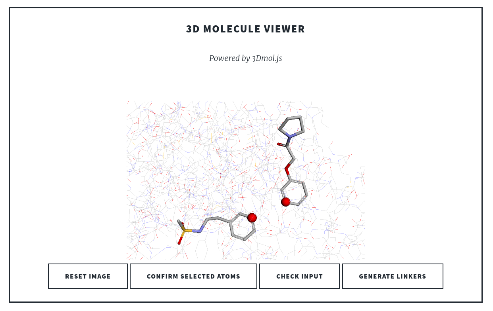

# OPIG Small Molecule Web Apps

*Note: This web spp is still in beta mode. The finished version will be accessible through the [OPIG website](http://opig.stats.ox.ac.uk/)*

This repository contains a Flask app for [DeLinker](https://pubs.acs.org/doi/10.1021/acs.jcim.9b01120) (Imrie et al. 2020). 

The app combines the [DeLinker implementation](https://github.com/oxpig/DeLinker) with [3DMol.js](https://3dmol.csb.pitt.edu/), so that the users can load two fragments into a molecule viewer, select the atomic exit vectors, and generate a downloadable set of linkers using DeLinker (see example below).

We will shortly be releasing a similar application for [DEVELOP](https://pubs.rsc.org/en/content/articlelanding/2021/sc/d1sc02436a), a CNN-based tool for fragment growing and elaboration.

     
     
The image above shows an example web app session: the user loads the fragment pair (and optionally the protein) into the browser, selects the atoms on each fragment to act as the exit vector and then clicks 'generate linkers' to run DeLinker. The DeLinker output can be downloaded as a csv file.
